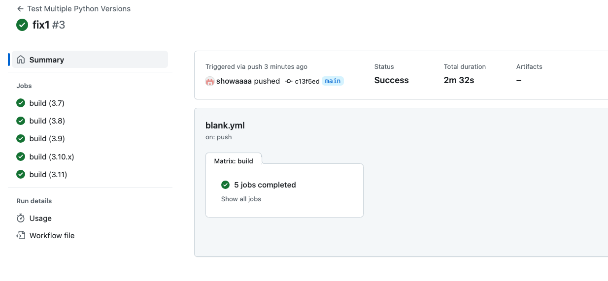
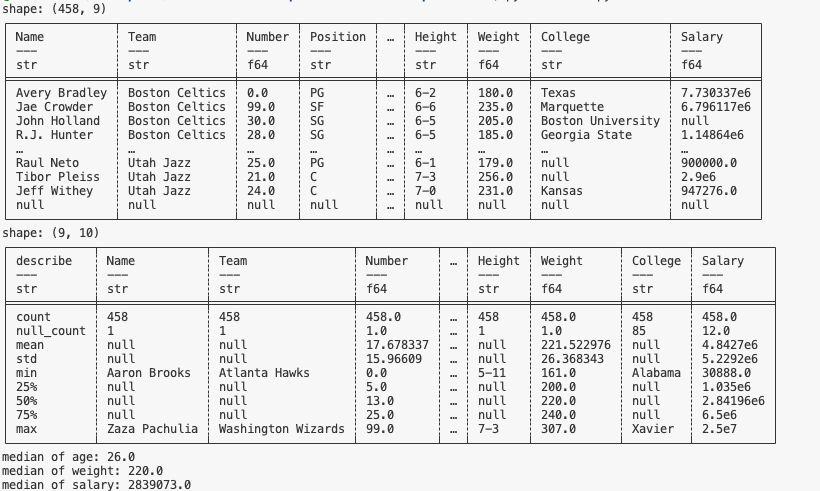
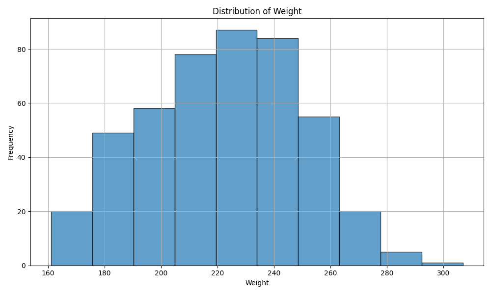
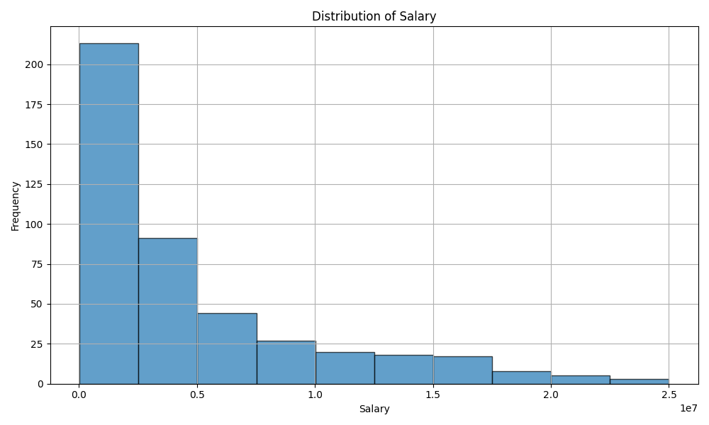

# week4GitHub Actions Matrix Build for Multiple Python Versions

## Matrix
This project can built and tested on python version 3.7,3.8,3.9,3.10.x,3.11

## Description
This project was generated from python template, which includes Makefile, requirements.txt, githubAction with different python version. It can automatically install, test, format, lint my change.
In this project, I read nba.csv file using polar. This file contains many players with name, team, number, position, age, height, weight, college and salary. Then i calculate mean, min, max, standard deviation and median for this dataset. Then i print the result to terminal for data visualization. Finally, I used matplotlib to generate age distribution graph shwon in Age_distribution.png, Weight_distribution_polar.png, Salary_distribution_polar.png.

## Sample Output

